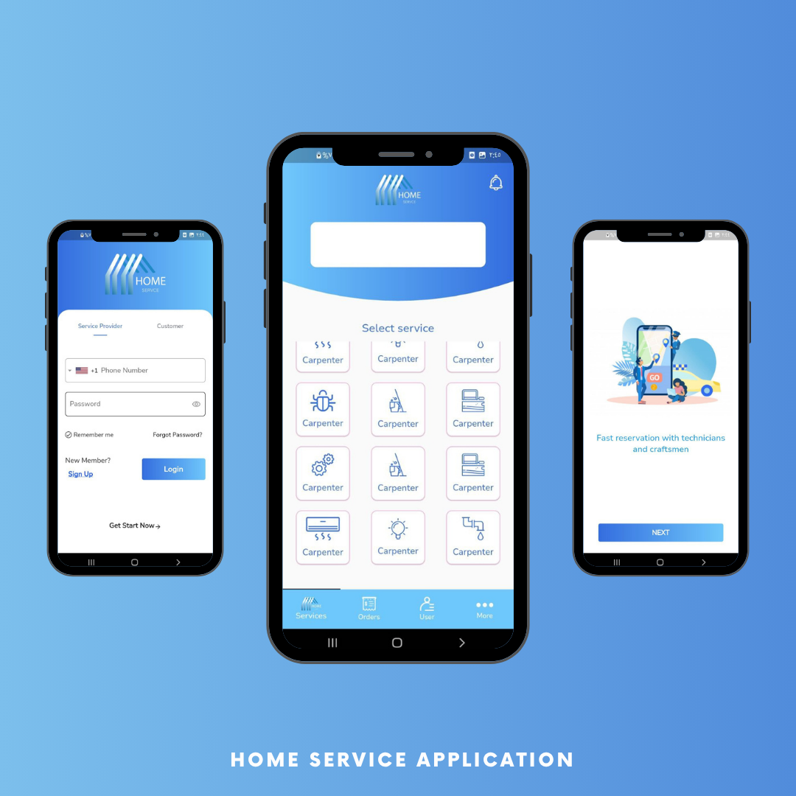
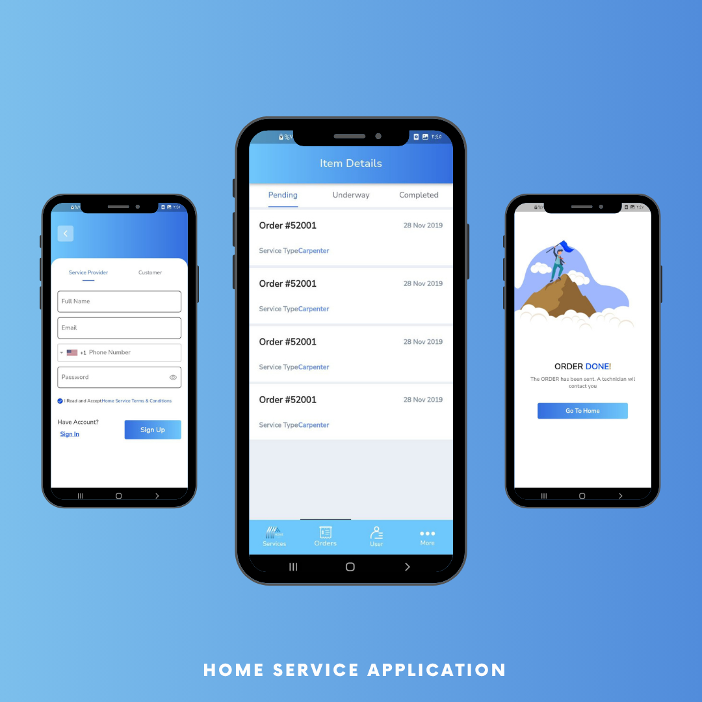
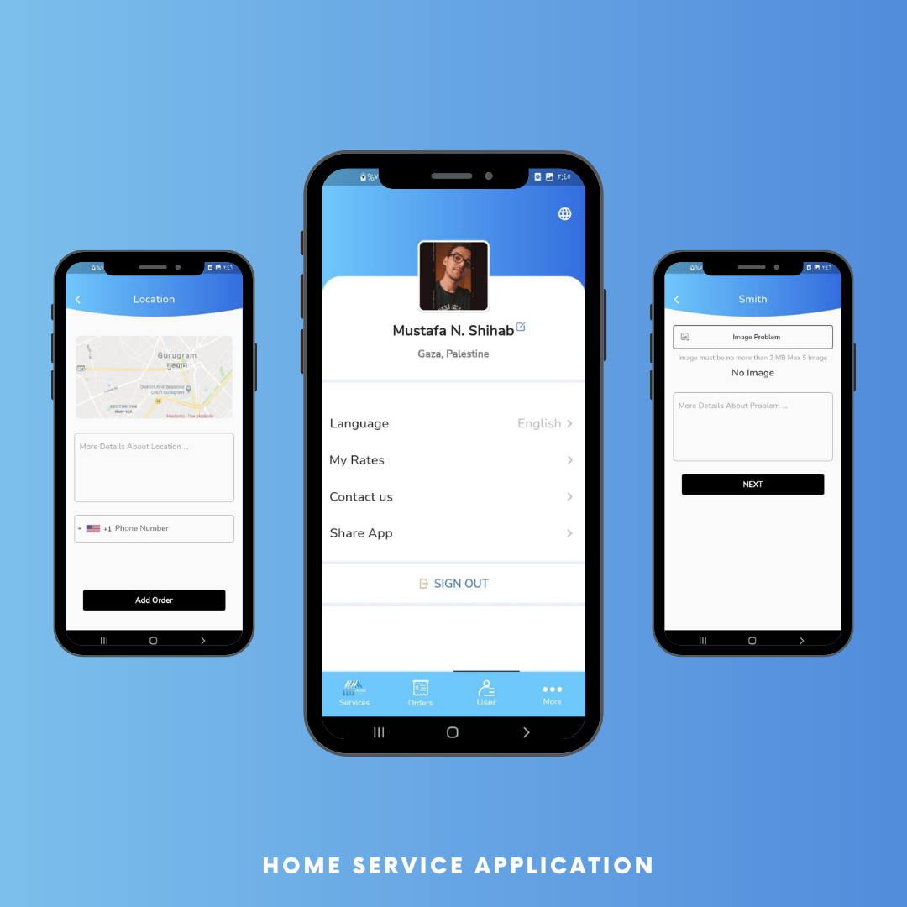

# Home Service App

A Flutter-based mobile application designed for home service bookings. This project showcases a modern UI implementation for a service booking platform, featuring onboarding, authentication, and order management flows. It is built as a final project for Mobile Development Course at UCAS.

---

## Features

- **User Authentication**: Secure Login and Signup screens with specialized input fields.
- **Onboarding**: An engaging onboarding experience to introduce users to the app features.
- **Home Dashboard**: A central hub for users to browse and select home services.
- **Order Management**: dedicated screens for detailing service issues and selecting locations (`OrderIssueScreen`, `OrderLocationScreen`).
- **Media Support**: Integration with device camera and gallery for image selection.
- **Modern UI/UX**: Polished interface using custom fonts (NunitoSans, Jannah) and SVG assets.

---

## Screenshots

